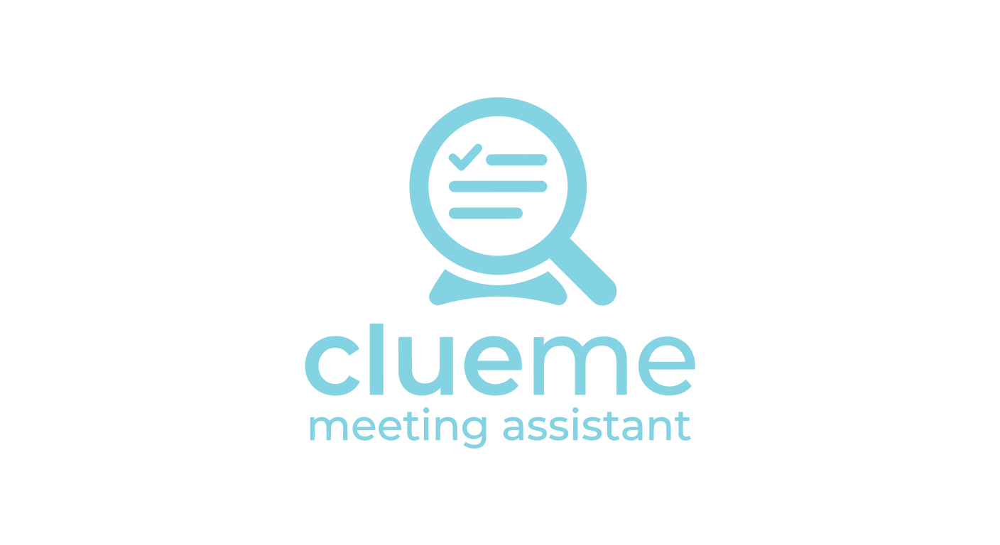
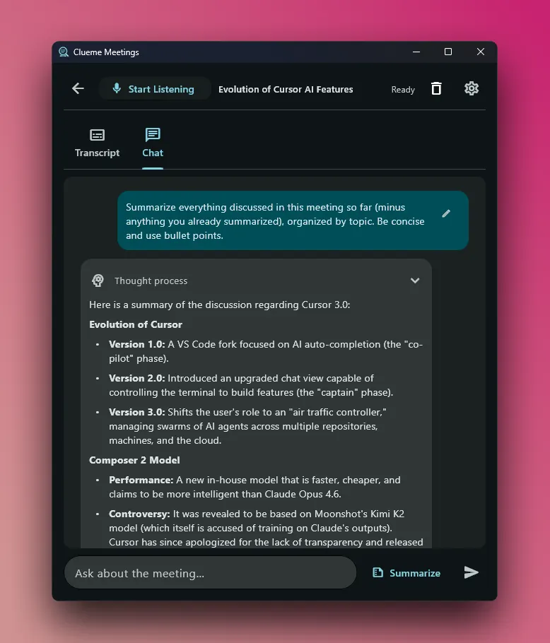
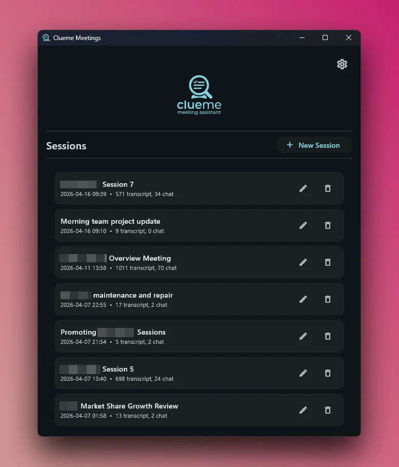
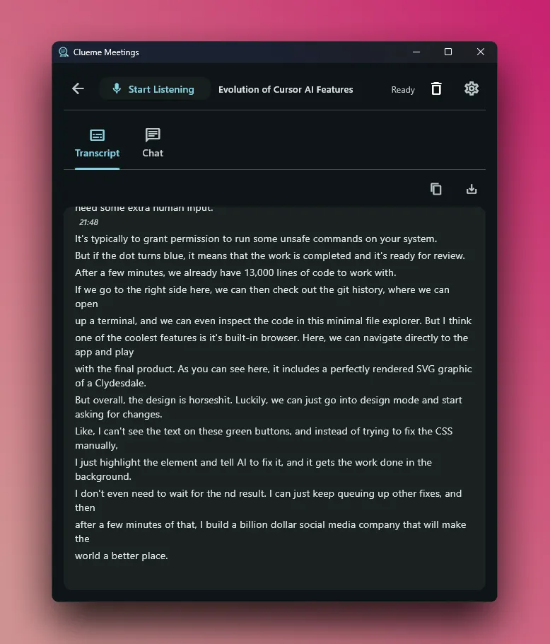
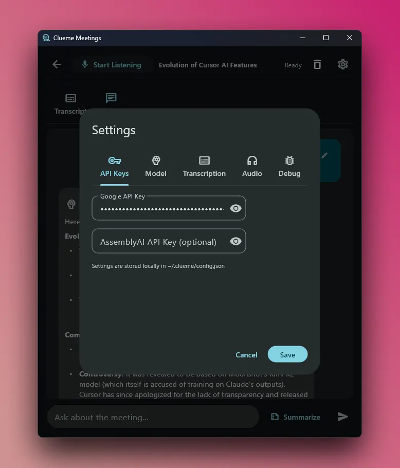
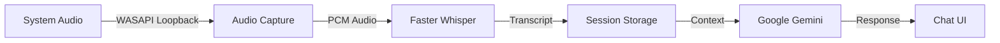

<p align="center">
  
</p>

<p align="center">
  <strong>Your local, privacy-first meeting assistant.</strong><br>
  Capture system audio, transcribe in real time with Whisper, and chat with AI about your meetings.
</p>

<p align="center">
  <a href="#getting-started">Getting Started</a> &bull;
  <a href="#features">Features</a> &bull;
  <a href="#how-it-works">How It Works</a> &bull;
  <a href="#roadmap">Roadmap</a> &bull;
  <a href="#license">License</a>
</p>

---



## What is Clueme?

Clueme Meetings is a desktop app that sits alongside your video calls and meetings. It captures your system audio, transcribes everything locally using [Faster Whisper](https://github.com/SYSTRAN/faster-whisper), and gives you an AI chat interface powered by [Google Gemini](https://ai.google.dev/) to ask questions, get summaries, and extract action items from your meetings -- all in real time.

**No cloud transcription.** Your audio never leaves your machine. Only the text transcript is sent to Gemini when you choose to chat.

## Features

- **Real-time local transcription** -- Audio is captured via WASAPI loopback and transcribed on-device with Faster Whisper. No data leaves your machine.
- **AI-powered chat** -- Ask Gemini about your meeting: get summaries, action items, key decisions, or anything else.
- **Session management** -- Save, rename, and revisit past meetings. Transcripts and chat history persist between sessions.
- **Multiple Whisper models** -- Choose from Tiny, Base, Small, or Turbo depending on your hardware and accuracy needs.
- **Configurable audio devices** -- Pick any system audio output to capture from (speakers, headphones, virtual cables, etc.).
- **Timestamped segments** -- Every transcript chunk is timestamped so you can see exactly when something was said.

## Screenshots

|               Session List               |            Live Transcript             |
| :--------------------------------------: | :------------------------------------: |
|  |  |

|               AI Chat               |               Settings               |
| :---------------------------------: | :----------------------------------: |
|  |  |

## Getting Started

### Prerequisites

- **Windows 10/11** (WASAPI loopback is Windows-only)
- **[uv](https://docs.astral.sh/uv/getting-started/installation/)** -- a fast Python package manager. It handles Python installation automatically.
- **A Google Gemini API key** -- Get one free at [Google AI Studio](https://aistudio.google.com/apikey)

### Install & Run

```bash
# Clone the repo
git clone https://github.com/Creative-Geek/Clueme-Meetings.git
cd Clueme-Meetings

# Install dependencies (uv will install Python 3.11+ if needed)
uv sync

# Run the app
uv run main.py
```

> **First launch note:** `uv run main.py` takes around 10 seconds to start each time due to Flet's startup overhead. This is normal.

### First-Time Setup

1. Open the app and click the **Settings** gear icon.
2. Paste your **Google Gemini API key** in the API Keys tab.
3. Choose your preferred **Whisper model** (see below) and **audio device**.
4. Close settings, then click **Start Listening** to begin capturing audio.

> **Model download:** The first time you click "Start Listening," the selected Whisper model will be downloaded. Download sizes:
>
> | Model | Size    | Speed    | Accuracy |
> | ----- | ------- | -------- | -------- |
> | Tiny  | ~75 MB  | Fastest  | Lower    |
> | Base  | ~142 MB | Fast     | Good     |
> | Small | ~466 MB | Moderate | Better   |
> | Turbo | ~1.6 GB | Slower   | Best     |

## How It Works



1. **Audio Capture** -- `PyAudioWPatch` captures system audio using Windows WASAPI loopback. No microphone needed -- it records whatever your speakers/headphones are playing.
2. **Transcription** -- Audio chunks are fed to `Faster Whisper`, which runs locally on your CPU (or GPU if available). Transcription happens in real time.
3. **Session Storage** -- Transcripts, chat history, and session metadata are saved as JSON files in `~/.clueme/sessions/`.
4. **AI Chat** -- When you send a message, the transcript is provided as context to Google Gemini. The AI can answer questions, summarize discussions, and extract key points.

## Tech Stack

| Component       | Technology                                                                |
| --------------- | ------------------------------------------------------------------------- |
| UI Framework    | [Flet](https://flet.dev/) (Flutter-based Python UI)                       |
| Transcription   | [Faster Whisper](https://github.com/SYSTRAN/faster-whisper) (CTranslate2) |
| Audio Capture   | [PyAudioWPatch](https://github.com/s0d3s/PyAudioWPatch) (WASAPI loopback) |
| AI Chat         | [Google Gemini](https://ai.google.dev/) via `google-genai`                |
| Package Manager | [uv](https://docs.astral.sh/uv/)                                          |

## Project Structure

```
Clueme-Meetings/
├── main.py                 # App entry point and main UI
├── src/
│   ├── agent.py            # Gemini AI chat integration
│   ├── config.py           # Configuration management
│   ├── transcriber.py      # Whisper transcription engine
│   ├── sessions.py         # Session save/load logic
│   ├── session_context.py  # Per-session runtime state
│   ├── logs.py             # Logging setup
│   ├── debug_log.py        # Debug utilities
│   └── ui/
│       ├── chat_tab.py         # AI chat interface
│       ├── transcript_tab.py   # Live transcript view
│       ├── session_list.py     # Session management sidebar
│       └── settings_dialog.py  # Settings modal
├── assets/                 # Logo and icon files
├── docs/screenshots/       # App screenshots
├── pyproject.toml          # Project metadata and dependencies
└── uv.lock                 # Locked dependency versions
```

## Data Storage

All user data is stored locally at `~/.clueme/`:

```
~/.clueme/
├── config.json          # API keys, preferences, model settings
├── sessions/            # One JSON file per meeting session
│   ├── session_abc123.json
│   └── ...
└── logs/                # Application logs
```

## Roadmap

- [ ] GPU acceleration for Whisper (CUDA support)
- [ ] Automatic meeting notes and summaries
- [ ] Export transcripts to Markdown, TXT, or SRT
- [ ] Microphone input support (capture your own voice too)
- [ ] Speaker diarization (who said what)
- [ ] AssemblyAI integration as an alternative transcription backend
- [ ] Linux and macOS support

## Contributing

Contributions are welcome! Feel free to open an issue or submit a pull request.

## License

This project is licensed under the **GNU General Public License v3.0** -- see the [LICENSE](LICENSE) file for details.
